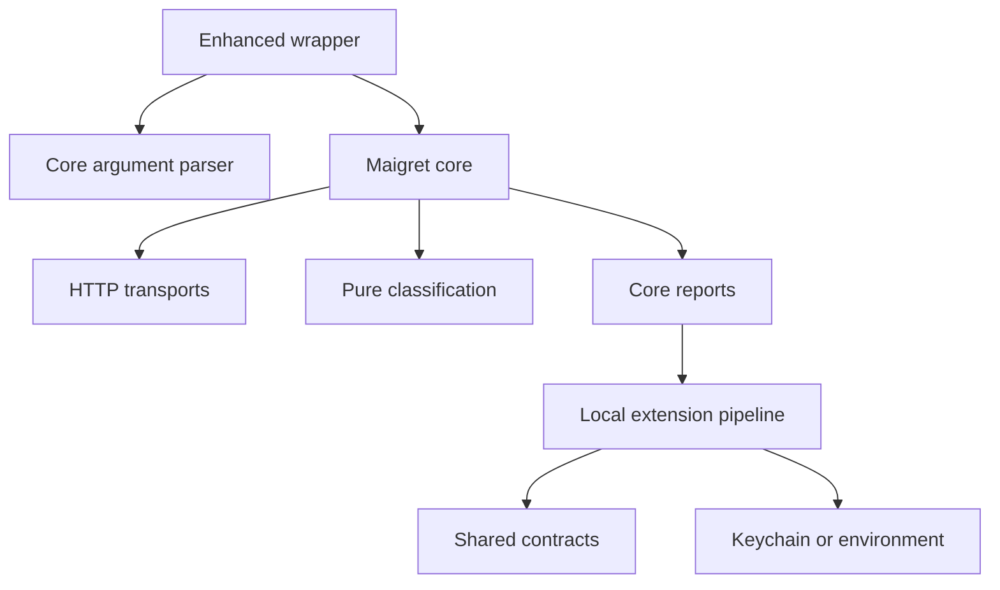
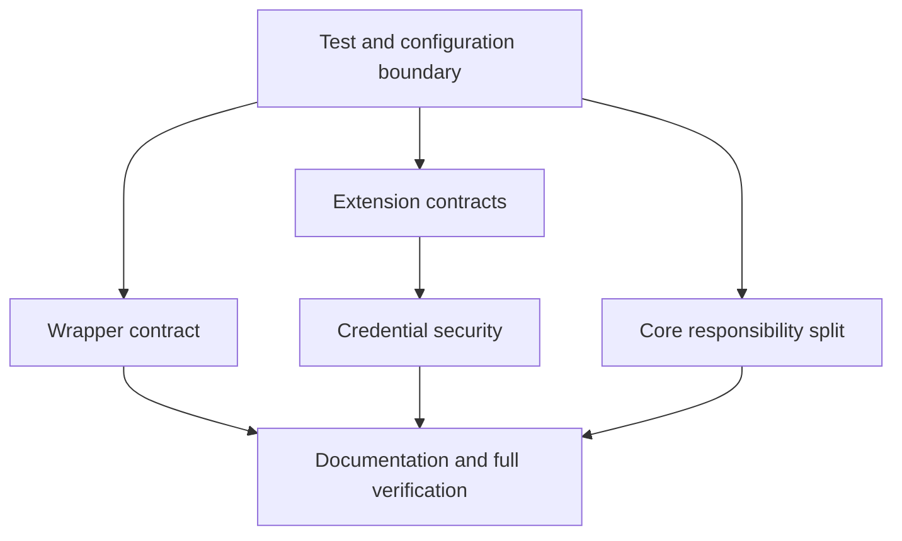

# refactor: Harden Maigret workspace boundaries

## Overview

Preserve Maigret's public CLI and library behavior while turning the current mixed
workspace into a reliable upstream core plus an explicit local extension layer.
The work fixes test discovery, the enhanced wrapper contract, unsafe defaults and
credential storage, then establishes shared extension models and separates HTTP
transport from result detection in the core scanner.

## Problem Frame

The repository currently mixes three concerns at its root: the tracked Maigret
package, locally developed OSINT enrichment scripts, and three embedded third-party
repositories. This causes pytest collection collisions, couples the enhanced wrapper
to modified upstream defaults, duplicates entity/relation models, and stores login
credentials with reversible fixed-key obfuscation. `maigret/checking.py` also owns
both HTTP transport implementations and detection/orchestration behavior.

## Requirements Trace

- **R1.** Root-level test execution must collect only Maigret's intended tests.
- **R2.** `maigret-search` must forward all standard Maigret options and their values
  unchanged while consuming only its own `--deep`, `--ai`, and `--web` flags.
- **R3.** Bundled settings must retain upstream conservative defaults; enhanced mode
  must request its expensive scan/report settings explicitly.
- **R4.** Local enrichment modules must share typed evidence, entity, record, node,
  edge, and relation-result contracts without changing existing JSON output shapes.
- **R5.** New credential writes must use environment variables or the macOS Keychain;
  cookies written by the enhanced workflow must be owner-readable only. The fixed
  encryption key and reversible credential file must be retired.
- **R6.** HTTP checker implementations and pure response classification must live
  outside `maigret/checking.py`, while existing imports from `maigret.checking` remain
  compatible.
- **R7.** Tests, README usage, extension boundaries, and security behavior must match
  the delivered implementation.

## Scope Boundaries

- Do not rewrite or vendor the internals of `MediaCrawler`, `Spider_XHS`, or
  `Xiaohongshu-Shield-Algorithm`.
- Do not redesign Maigret's site database schema or account-claim semantics.
- Do not add a new secret-management dependency or silently migrate legacy
  credentials.
- Do not build a production multi-user Web job system in this change.
- Do not move every local script; introduce a package boundary only for shared,
  stable extension contracts and security helpers.

## Context & Research

### Relevant Code and Patterns

- `pytest.ini` and `Makefile` define the intended `tests/` suite.
- `maigret/maigret.py` already centralizes argument definitions and settings-derived
  defaults; the wrapper should reuse that parser rather than duplicate option arity.
- `maigret/result.py` uses enums and dataclasses-like objects for stable result
  contracts.
- `entity_enrich.py` and `relations.py` already serialize dataclasses with `asdict`.
- `maigret/checking.py` exposes checker classes and classification helpers used by
  tests; compatibility re-exports avoid a breaking library change.

### Institutional Learnings

- No repo-local `docs/solutions/` records exist. The governing workspace rule is to
  keep independent projects isolated and update README when behavior or setup changes.

### External References

- No new framework or dependency is introduced. Credential storage uses existing
  process environment variables and the native macOS `security` command, with an
  explicit unsupported-platform failure instead of insecure fallback persistence.

## Key Technical Decisions

| Decision | Rationale |
| --- | --- |
| Configure pytest discovery rather than moving embedded repositories | Preserves user-owned checkouts while restoring a deterministic core suite. |
| Reuse Maigret's parser to identify positional usernames | Prevents the wrapper from guessing which CLI options consume values. |
| Keep enhanced defaults in the wrapper | Upstream defaults remain testable and library users avoid unexpectedly expensive runs. |
| Introduce `maigret_extensions` only for shared contracts/security | Creates a real boundary without a high-risk bulk move of experimental collectors. |
| Use Keychain or environment variables, never a fallback credential file | Avoids fixed-key obfuscation and new dependencies while failing closed. |
| Move transports and classification behind compatibility exports | Reduces `checking.py` responsibilities without breaking callers. |

## Open Questions

### Resolved During Planning

- **Should embedded repositories be deleted or relocated?** No. They are user-owned,
  untracked work and are excluded from core discovery only.
- **Should the wrapper become a new Python CLI?** No. Keep its Bash entry point and
  ask the authoritative Python parser for usernames.
- **Should Linux credentials fall back to plaintext?** No. Linux users provide
  environment variables until a native backend is deliberately added.

### Deferred to Implementation

- Exact compatibility imports needed after transport extraction will be determined
  by import and test failures, without changing the public symbol names.
- Legacy `cookies/credentials.json` is left untouched and ignored; runtime must stop
  reading it and print a migration instruction.

## High-Level Technical Design

> *This illustrates the intended approach and is directional guidance for review,
> not implementation specification. The implementing agent should treat it as
> context, not code to reproduce.*

## Implementation Units

- [x] **Unit 1: Restore deterministic core defaults and test discovery**

**Goal:** Isolate the official suite and restore conservative bundled behavior.

**Requirements:** R1, R3

**Dependencies:** None

**Files:**
- Modify: `pytest.ini`
- Modify: `maigret/resources/settings.json`
- Test: `tests/test_cli.py`

**Approach:** Set an explicit core test path and recursion exclusions. Restore the
settings values asserted by the upstream CLI contract while leaving local site data
additions intact.

**Test scenarios:**
- Integration: root pytest collection does not import embedded repository tests.
- Happy path: parsing a username produces the documented 500-site and opt-in report
  defaults.

**Verification:** Core collection succeeds without import-path mismatch and CLI
default tests pass.

- [x] **Unit 2: Make enhanced wrapper argument-safe**

**Goal:** Preserve every standard CLI argument and make enhanced behavior explicit.

**Requirements:** R2, R3

**Dependencies:** Unit 1

**Files:**
- Modify: `maigret-search`
- Create: `tests/test_enhanced_wrapper.py`

**Approach:** Remove only wrapper-owned flags, forward the remaining argument array
unchanged, derive usernames through the core parser, and add enhanced scan/report
flags explicitly. Stop post-processing if the core scan fails.

**Execution note:** Start with failing subprocess tests for option-value forwarding.

**Test scenarios:**
- Happy path: multiple usernames reach both core and post-processing.
- Edge case: `--timeout 10`, `--site GitHub`, and a proxy URL remain option values,
  not usernames.
- Error path: a failing core command prevents verification and enrichment stages.
- Integration: enhanced defaults request top 3000, all report formats, sorting, and
  optional Cloudflare bypass without modifying bundled defaults.

**Verification:** Wrapper tests observe the exact core argument vector and correct
post-processing targets.

- [x] **Unit 3: Establish extension data contracts**

**Goal:** Give enrichment and relation modules one typed serialization contract.

**Requirements:** R4

**Dependencies:** Unit 1

**Files:**
- Create: `maigret_extensions/__init__.py`
- Create: `maigret_extensions/models.py`
- Modify: `entity_enrich.py`
- Modify: `relations.py`
- Create: `tests/test_extension_models.py`

**Approach:** Move the existing compatible dataclasses into the extension package,
add an evidence level/record contract, and retain the current field names and
`asdict`-compatible output. Root scripts import and re-export models where necessary.

**Test scenarios:**
- Happy path: entity and relation models round-trip to their existing dictionary
  shapes.
- Edge case: duplicate evidence records collapse deterministically.
- Integration: `entity_enrich` and `relations` share identical model classes.

**Verification:** Existing enrichment serialization remains readable and model tests
pass without circular imports.

- [x] **Unit 4: Replace fixed-key credential persistence**

**Goal:** Fail closed for credentials and protect newly written session cookies.

**Requirements:** R5

**Dependencies:** Unit 3

**Files:**
- Create: `maigret_extensions/secrets.py`
- Modify: `auto_platform.py`
- Modify: `cookies/__init__.py`
- Create: `tests/test_extension_secrets.py`

**Approach:** Resolve per-platform credentials from environment first and macOS
Keychain second. Store credentials only in Keychain; unsupported systems receive a
clear environment-variable instruction. Use atomic owner-only writes for cookie JSON.

**Execution note:** Implement secret resolution and persistence test-first with
subprocess and platform behavior mocked.

**Test scenarios:**
- Happy path: environment credentials take precedence and Keychain JSON is decoded.
- Error path: missing Keychain and missing environment produce an actionable error.
- Security: saved cookie files have mode `0600`; no fixed key or credential-file read
  remains in runtime code.
- Integration: auto-login setup and login consume the shared secret helper.

**Verification:** Security tests pass and repository search finds no fixed encryption
key in active code.

- [x] **Unit 5: Separate transport and detection responsibilities**

**Goal:** Reduce `checking.py` to request construction and orchestration while keeping
its public imports stable.

**Requirements:** R6

**Dependencies:** Unit 1

**Files:**
- Create: `maigret/transports.py`
- Create: `maigret/detection.py`
- Modify: `maigret/checking.py`
- Modify: `tests/test_checking.py`
- Create: `tests/test_detection.py`

**Approach:** Move checker implementations and protocol selection to `transports.py`.
Extract the claimed/available/unknown classification into a pure function in
`detection.py`. Keep compatibility imports in `checking.py` and orchestration there.

**Execution note:** Characterize message, status-code, response-URL, and error
classification before moving implementation.

**Test scenarios:**
- Happy path: each supported check type produces the same status as before.
- Edge case: empty presence strings and absent response bodies retain current rules.
- Error path: detected access/server/webgate errors yield UNKNOWN.
- Integration: legacy imports and a local HTTP check still use the extracted modules.

**Verification:** Existing checking tests plus new pure classification tests pass and
`checking.py` no longer defines HTTP checker classes.

- [x] **Unit 6: Align documentation and verify the workspace**

**Goal:** Make the delivered operating model discoverable and prove all requirements.

**Requirements:** R7 and completion evidence for R1-R6

**Dependencies:** Units 2-5

**Files:**
- Modify: `README.md`
- Modify: `README.zh-CN.md`
- Modify: `docs/plans/2026-06-19-001-refactor-maigret-workspace-hardening-plan.md`

**Approach:** Document core versus enhanced operation, secret environment variables,
Keychain behavior, embedded-repository boundaries, and verification commands. Mark
this plan complete only after tests, lint, syntax checks, and review succeed.

**Test scenarios:**
- Test expectation: none -- documentation only; commands and paths are validated by
  the implementation suite and final verification.

**Verification:** Both READMEs describe the same operational contract and every
requirements-trace item has concrete evidence.

## System-Wide Impact

- **Interaction graph:** CLI/parser, wrapper, scan transport, classification, reports,
  enrichment, cookie persistence, and tests are affected; site schema and Web routes
  remain unchanged.
- **Error propagation:** Core scan failures stop the wrapper. Secret lookup failures
  are explicit and never fall back to plaintext persistence. Transport errors retain
  existing `CheckError` behavior.
- **State lifecycle risks:** Cookie writes become atomic and permission-restricted;
  legacy credential files are neither deleted nor rewritten.
- **API surface parity:** Imports from `maigret.checking` remain valid while new direct
  imports from `maigret.transports` and `maigret.detection` become available.
- **Integration coverage:** Wrapper subprocess tests, local HTTP checker tests, model
  identity tests, and secret-store tests cover cross-layer behavior.
- **Unchanged invariants:** Site database format, claim status enum values, report JSON
  shapes, CLI flag names, and local collector outputs do not change.

## Risks & Dependencies

| Risk | Mitigation |
| --- | --- |
| Dirty worktree contains user changes | Modify only scoped files and never revert site additions or untracked collectors. |
| Moving checker code creates import cycles | Keep shared errors/types below both modules and retain compatibility imports. |
| Wrapper tests accidentally start Docker/network calls | Inject command paths and disable Cloudflare startup through test environment hooks. |
| Keychain is unavailable in CI | Mock native calls and exercise environment fallback on all platforms. |
| Full suite contains live-network tests | Separate deterministic suite evidence from explicitly identified external-network failures. |

## Documentation / Operational Notes

- Enhanced mode is intentionally more expensive than `python -m maigret`; the wrapper
  owns that difference.
- Operators should search logs for `core scan failed`, `credential`, `Keychain`,
  `Webgate`, and `Connection timeout` after rollout. Healthy runs complete the core
  report before enrichment; any secret fallback to a file is a release blocker.
- Validate for one local run and one CI run. Roll back the wrapper/security refactor if
  argument vectors or report names change unexpectedly.

## Sources & References

- Related code: `maigret/maigret.py`, `maigret/checking.py`, `maigret/result.py`
- Related tests: `tests/test_cli.py`, `tests/test_checking.py`, `Makefile`
- Workspace rules: `../AGENTS.md`
