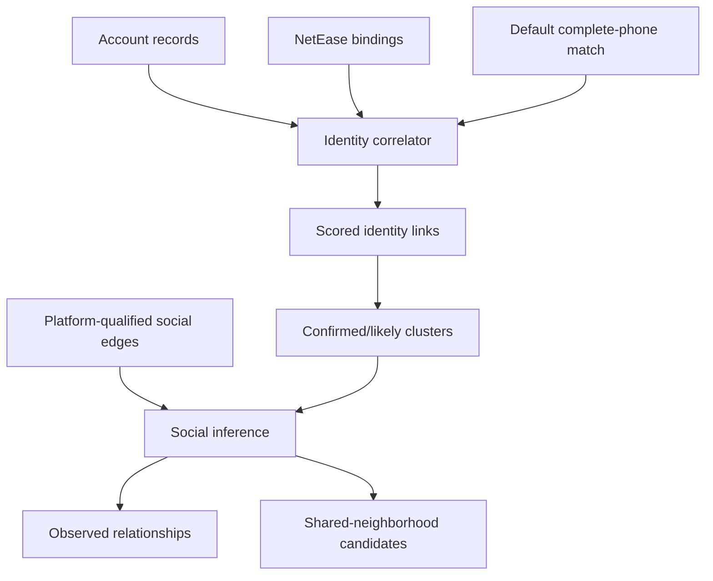

# feat: Add privacy-preserving cross-platform social inference

## Overview

Turn the existing NetEase, Weibo, GitHub, Gravatar, and interaction collectors
into an evidence-driven identity and social-inference pipeline. Explicit bindings
and stable public identifiers can join accounts; usernames remain weak candidates.
Complete-phone correlation is strong by default, never persists the raw value,
and never performs reverse lookup. HMAC fingerprints are optional.

## Requirements Trace

- **R1.** Every account and edge key must include the platform so equal IDs on
  different platforms never collide.
- **R2.** Cross-platform identity links must contain typed evidence, a deterministic
  score, and one of `confirmed`, `likely`, `possible`, or `weak`.
- **R3.** NetEase-to-Weibo bindings must produce confirmed links and usable identity
  clusters without requiring username equality.
- **R4.** Phone values must never appear in new persisted output or console text;
  complete-number correlation is strong and enabled by default, while masked
  numbers are rejected and an HMAC key is optional.
- **R5.** Direct social actions and inferred shared-neighbor relationships must be
  distinct, scored, explainable, and based on platform-qualified nodes.
- **R6.** Identity clusters may collapse social nodes only for confirmed/likely
  links; weak username matches must not alter the social graph.
- **R7.** `entity_enrich` must emit machine-readable identity-link and social-
  inference reports while preserving existing entity/relation outputs except for
  mandatory phone redaction.
- **R8.** Research limits, default/disable operation, evidence meanings, tests, and runtime
  validation must be documented.

## Scope Boundaries

- No phone-number enumeration, reverse lookup, SMS workflow, contact upload, or
  private mobile API automation.
- No assertion that follows, mentions, reposts, or shared neighbors prove an
  offline friendship or real-world identity.
- No new platform login automation and no bypass of captcha/access controls.
- No new dependency for phone parsing or graph analysis.
- No automatic migration or deletion of user-generated historical reports.

## Key Technical Decisions

| Decision | Rationale |
| --- | --- |
| Platform-qualified account keys | Prevents silent cross-platform UID collisions. |
| Evidence-family maximum before combination | Avoids double-counting correlated observations. |
| HMAC with operator-provided key | Plain hashes are reversible over the small phone-number space. |
| Complete-phone correlation on by default | Treats an exact complete number as strong identity evidence without persisting it. |
| Union-find only for score >= 0.70 | Weak username/name similarity cannot merge identities. |
| Separate observed and inferred social outputs | Prevents heuristic neighborhood overlap from being presented as fact. |

## High-Level Technical Design

> *This illustrates the intended approach and is directional guidance for review,
> not implementation specification.*

## Implementation Units

- [x] **Unit 1: Qualify social graph identifiers**

**Goal:** Eliminate cross-platform node and edge collisions and retain degree data.

**Requirements:** R1

**Files:**
- Modify: `maigret_extensions/models.py`
- Modify: `relations.py`
- Modify: `entity_enrich.py`
- Modify: `weibo.py`
- Modify: `weibo_relations.py`
- Modify: `weibo_interactions.py`
- Test: `tests/test_cross_platform_correlation.py`

**Test scenarios:**
- Two nodes with user ID `123` on Weibo and NetEase remain distinct.
- Same source/destination IDs on two platforms produce distinct edge identities.
- A second-degree node retains its degree in the rendered graph.

**Verification:** All merge indexes and serialized endpoints use platform-qualified
keys while collector requests continue to use native IDs.

- [x] **Unit 2: Add private phone handling and safe serialization**

**Goal:** Normalize and correlate full phones without persisting the raw value.

**Requirements:** R4, R7

**Dependencies:** Unit 1

**Files:**
- Create: `maigret_extensions/privacy.py`
- Modify: `relations.py`
- Modify: `entity_enrich.py`
- Test: `tests/test_cross_platform_correlation.py`

**Execution note:** Implement phone rejection, fingerprinting, and serialization
test-first.

**Test scenarios:**
- CN local and `+86` forms produce the same fingerprint.
- Masked, partial, too-short, and too-long values are rejected.
- Complete normalized numbers correlate by default; explicit disable prevents it.
- Entity, binding, relation, console, and JSON serializers contain no raw phone.

**Verification:** Repository tests search outputs for supplied sentinel phone values
and find none.

- [x] **Unit 3: Implement identity evidence and clustering**

**Goal:** Produce scored cross-platform links and deterministic identity clusters.

**Requirements:** R2, R3, R6

**Dependencies:** Units 1-2

**Files:**
- Create: `maigret_extensions/correlation.py`
- Modify: `maigret_extensions/models.py`
- Test: `tests/test_cross_platform_correlation.py`

**Execution note:** Implement scoring thresholds and binding behavior test-first.

**Test scenarios:**
- NetEase explicit Weibo URL creates a confirmed link.
- Exact public email creates a confirmed link.
- Avatar phash creates a likely link.
- Username-only match remains weak and does not join clusters.
- Default complete-phone matching creates a confirmed link without raw values.
- Repeated evidence in one family is counted once.

**Verification:** Link and cluster order is deterministic and every score has
serializable supporting evidence.

- [x] **Unit 4: Derive explainable social relationships**

**Goal:** Transform collected edges into observed relationships and bounded
shared-neighbor candidates across identity clusters.

**Requirements:** R5, R6

**Dependencies:** Unit 3

**Files:**
- Create: `maigret_extensions/social_inference.py`
- Test: `tests/test_social_inference.py`

**Execution note:** Implement inference rules test-first using synthetic graphs.

**Test scenarios:**
- Mutual follow outranks one-way follow; repeated mention and repost use documented
  scores and remain `observed`.
- Two nodes with sufficient shared outgoing neighbors create one explainable
  `shared_neighborhood` inference.
- One shared neighbor or low Jaccard overlap creates no inference.
- Confirmed identity aliases collapse; weak aliases remain separate.
- Duplicate and self relationships are removed deterministically.

**Verification:** Every output states `observed` or `inferred`, includes score and
evidence, and never labels a relationship as friendship.

- [x] **Unit 5: Integrate reports, CLI controls, and documentation**

**Goal:** Run correlation and inference from `entity_enrich` and document operation.

**Requirements:** R7, R8

**Dependencies:** Units 1-4

**Files:**
- Modify: `entity_enrich.py`
- Modify: `maigret-search`
- Modify: `README.md`
- Modify: `README.zh-CN.md`
- Modify: `docs/research/platform-identity-correlation.md`
- Modify: `docs/plans/2026-06-19-002-feat-cross-platform-social-inference-plan.md`
- Test: `tests/test_cross_platform_correlation.py`
- Test: `tests/test_social_inference.py`

**Test scenarios:**
- Enrichment writes deterministic `identity_links_*` and `social_inferences_*` JSON.
- Default runs redact and strongly correlate complete phones.
- `--no-phone-correlation` explicitly disables default matching.
- Wrapper disables matching only through `MAIGRET_DISABLE_PHONE_CORRELATION=1`.

**Verification:** Both READMEs match implemented flags and safety boundaries;
deterministic tests, syntax checks, and review pass before this plan is completed.

Completed with `30` focused tests and `339` deterministic core tests passing.
Five pre-existing live-network tests were explicitly deselected; one attempted
Reddit request was also run separately and failed only on an external TLS timeout.

## System-Wide Impact

- **Interaction graph:** report harvesting, relation collection, NetEase binding
  traversal, graph rendering, enrichment CLI, wrapper, and JSON consumers.
- **Error propagation:** unavailable platforms remain per-source errors; a missing
  phone key only omits stable HMAC fingerprints and does not disable correlation.
- **State lifecycle:** outputs are written after in-memory redaction; historical files
  are not rewritten.
- **Unchanged invariants:** native platform IDs remain unchanged for HTTP requests;
  existing relation fields remain readable; phone lookup is never introduced.

## Risks & Mitigations

| Risk | Mitigation |
| --- | --- |
| False identity merge | High thresholds, evidence-family dedupe, no username auto-merge. |
| Phone disclosure | In-memory comparison, raw-value serializer tests, redacted console output. |
| Celebrity shared-neighbor noise | Minimum overlap plus Jaccard threshold and inferred labeling. |
| Undocumented NetEase endpoint drift | Best-effort error handling and source labeling. |
| Existing dirty worktree | Surgical edits only; never revert user data or unrelated scripts. |

## Post-Deploy Monitoring & Validation

- Search logs for `phone correlation`, `identity link`, `binding`, `captcha`, and
  `platform collision`.
- Healthy signal: all raw-phone sentinel tests pass, identity links contain evidence,
  and inferred relationships remain below observed relationships in precedence.
- Failure signal: raw phone in any new output, a weak link joining a cluster, or equal
  native IDs collapsing across platforms. Any is a rollback blocker.
- Validation window: one deterministic CI run plus one operator-authorized local
  enrichment run; owner is the local operator.

## Sources & References

- Origin: `docs/research/platform-identity-correlation.md`
- Existing pipeline: `entity_enrich.py`, `relations.py`, `weibo_relations.py`
- Shared contracts: `maigret_extensions/models.py`
- GitHub REST users/followers documentation
- Weibo official users/friendships endpoints (app-key protected)
